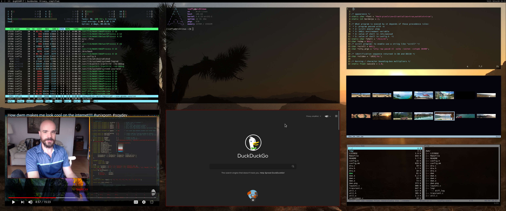
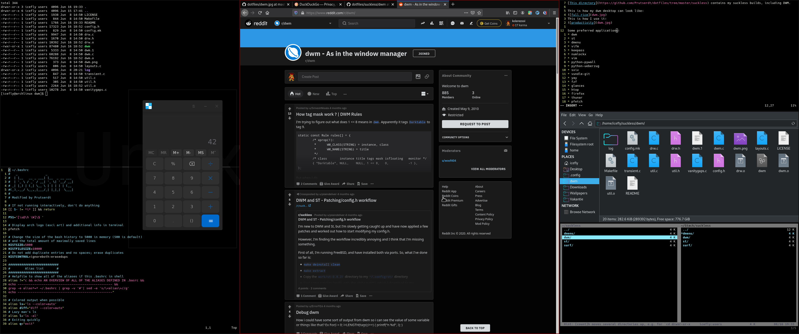

<!Dit is de ~/README.md file voor mijn dotfile bare Github repo/>
# :sparkles:Dotfiles:sparkles: repo, including my suckless builds:bangbang:
Here I store the :sparkles:dotfiles:sparkles: of my Arch system plus some other stuff.

[This directory](https://github.com/Prutserdt/dotfiles/tree/master/suckless) contains my suckless builds, including DWM. 

This is how my dwm desktop can look like:

This is how I use it:

Some preferred applications:
* dwm
* st
* dmenu
* vifm
* keepass
* numlockx
* vim
* python-pywall
* python-ueberzug
* sxiv
* vundle-git 
* yay
* fzf
* glances
* htop
* firefox
* thunar
* pfetch
* figlet
* Hack font

My i3 gaps config files are still a part of this repo although I do not use it anymore.

## :eight_pointed_black_star:The `dotfiles` command
This alias from the *[.bashrc](https://github.com/Prutserdt/dotfiles/blob/master/.bashrc)*
is running the shell script 
*[./config/dotfiles.sh](https://github.com/Prutserdt/dotfiles/blob/master/.config/dotfiles.sh)*
.This script will first check the status of the dotfiles and after that a commit/push 
or pull can be made to the repo, all from one command! :godmode:

## :eight_pointed_black_star:Add an additional dotfile to this repo :inbox_tray:
(`config` is an alias from *[.bashrc](https://github.com/Prutserdt/dotfiles/blob/master/.bashrc)*)

    config add .example
    config commit -m "Add my .example"
    config push -v

## :eight_pointed_black_star:Remove an existing dotfile from this repo :outbox_tray:
(`config` is an alias from *[.bashrc](https://github.com/Prutserdt/dotfiles/blob/master/.bashrc)*)

    config rm .example
    config commit -m "Remove my .example"
    config push -v

## :eight_pointed_black_star:References:
- :book: https://www.atlassian.com/git/tutorials/dotfiles
- :cinema: https://www.youtube.com/watch?v=tBoLDpTWVOM
- :book: https://stackoverflow.com/questions/1595848/configuring-git-over-ssh-to-login-once
