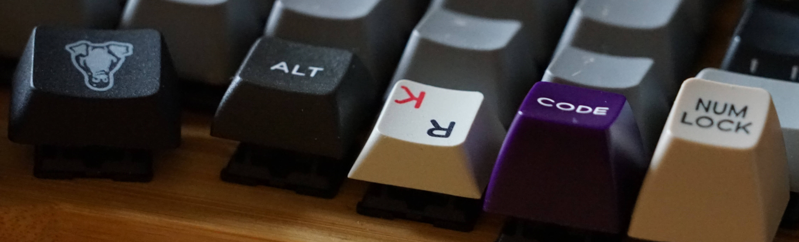
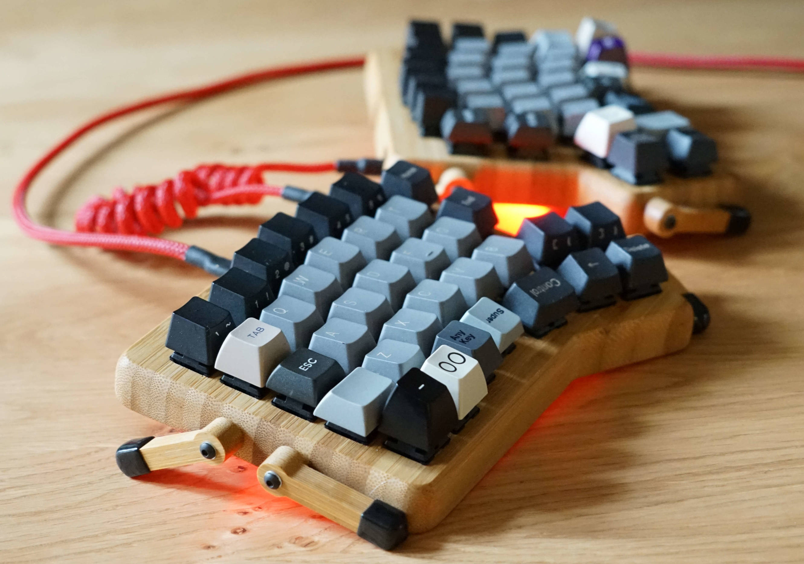
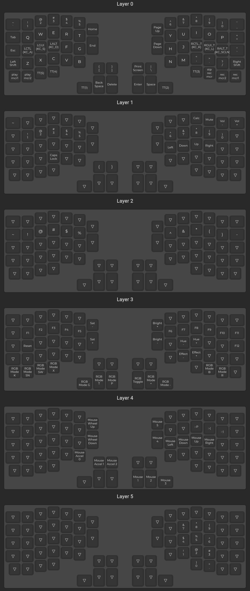

<!This is the  ~/qmk_firmware/keyboards/redox/keymaps/Prutserdt/README.md file for the dotfile bare Github repo/>

# :sparkles:Redox keyboard qmk configuration:sparkles:

My configuration has a qwerty layout and 4 additional layers. 

Note: my layout is not a finished product yet and is changed frequently.
