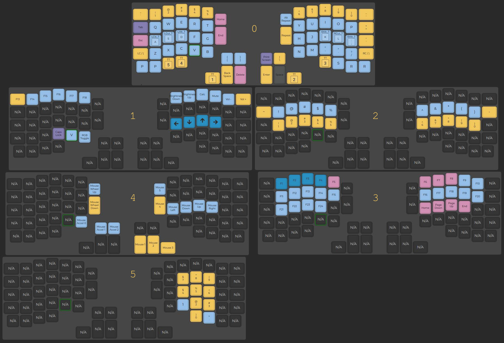

<!This is the  ~/qmk_firmware/keyboards/redox/keymaps/Prutserdt/README.md file for the dotfile bare Github repo/>

# :sparkles:Redox keyboard qmk configuration:sparkles:

My configuration has a qwerty layout and 4 additional layers. 

NOTE: the two R buttons on layer 0 on the bottom right are macro buttons, and the S is the stop macro recording. The bottom left P buttons on layer 0 are the macro play buttons. The V button on layer 1 types out information about the current firmware version. Check my keymap.c for more details.
